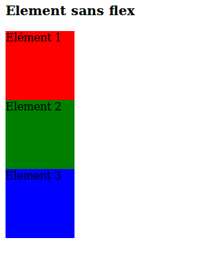
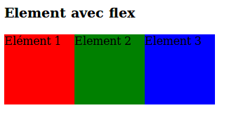

# flexbox

## Mise en page avec flexbox

### Un conteneur, des éléments

+1 Il faut définir un conteneur et placer à l'intérieur plusieurs éléments.

    

      
Elément 1

      
Elément 2

      
Elément 3

    

    

#### Rajoutons du flex
dans le css on cible le parent (le container)
    #container{
      display:flex;
    }

#### aligner horizontalement : justify content

+1
